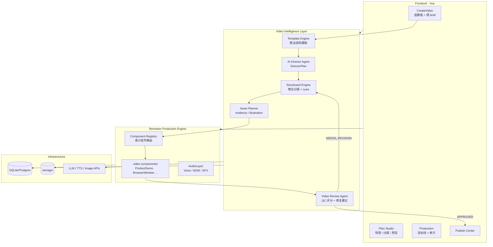

# XueAI Video Intelligence Architecture

> **首席架构师设计文档** — 将 `skill/xueai-video-skills` 的方法论模块化集成到 XueAI Video Factory。  
> **原则**：不复制 Skill 文件结构；吸收 **口播驱动动效、语义镜头、QC 门禁、素材溯源** 等思想，映射到 SaaS 多租户产品架构。  
> **开发方式**：分阶段交付，每次只实现一个 Sprint 的代码。

---

## 0. 现状与差距

### 已有模块（可复用，需重组）

| 现有路径 | 能力 | 迁移目标 |
|----------|------|----------|
| `backend/src/modules/director/` | DirectorBrief + Cinematic Scenes | → `video-intelligence/director/` |
| `backend/src/modules/review/` | LLM 审片评分 | → `video-intelligence/review/` |
| `backend/src/modules/stock/` | Pexels 搜索 | → `video-intelligence/asset-planner/stock/` |
| `backend/src/modules/ai/script.service.ts` | 脚本生成入口 | → 调用 Storyboard Engine |
| `remotion/src/components/CinematicScene.tsx` | Ken Burns 静帧 | → 保留为 fallback，新组件优先 |
| `workspace/templates.data.ts` | 营销 prompt 列表 | **不是** Template Engine，需新建 |

### 塑料感根因（对照 xueai-video-skills）

| Skill 要求 | 当前系统 | 差距 |
|------------|----------|------|
| 口播驱动时间轴 | 固定 scene.duration | 缺 cue 时间码 |
| 语义镜头模式（6 种） | 单一 CinematicScene | 缺 ProductDemo / BrowserWindow 等 |
| input → process → result | 只有 visualPrompt | 缺 viewerTask / process |
| 连续 3 镜静态 >5s 禁止 | 无检测 | Review Agent 未接 Remotion |
| evidence vs illustration | 全 AI 图 | 无素材角色分类 |
| QC P0/P1 门禁 | 直接导出 | 无发布阻断 |

---

## 1. 新架构图



### 层级职责

```
┌─────────────────────────────────────────────────────────┐
│  Presentation (Vue)                                      │
│  CreateVideo · VideoPlan · Production · Templates       │
├─────────────────────────────────────────────────────────┤
│  Video Intelligence Layer  ← 本设计核心                  │
│  template · director · storyboard · asset-planner · review│
├─────────────────────────────────────────────────────────┤
│  Production Orchestrator                                 │
│  production.service · task · ws                          │
├─────────────────────────────────────────────────────────┤
│  Remotion Engine                                         │
│  video-components · compositions · render CLI            │
├─────────────────────────────────────────────────────────┤
│  Shared Contracts                                        │
│  @xueai/shared: DirectorPlan · StoryboardScene · RenderInput│
└─────────────────────────────────────────────────────────┘
```

---

## 2. 数据库设计

### 2.1 新增表 — Template Engine

```prisma
/// 商业视频结构模板（不是成品视频）
model VideoTemplate {
  id          String   @id @default(cuid())
  slug        String   @unique          // saas-promo, ai-tool-intro, ...
  name        String
  category    String                   // SaaS宣传 | AI工具 | 产品发布 | 品牌广告 | 教程
  description String?
  styleId     String?
  style       VideoTemplateStyle? @relation(fields: [styleId], references: [id])
  duration    Int      @default(30)
  ratio       String   @default("16:9")
  isSystem    Boolean  @default(true)
  scenes      VideoTemplateScene[]
  projects    Project[]
  createdAt   DateTime @default(now())
  updatedAt   DateTime @updatedAt
}

model VideoTemplateScene {
  id           String        @id @default(cuid())
  templateId   String
  template     VideoTemplate @relation(fields: [templateId], references: [id], onDelete: Cascade)
  order        Int
  purpose      String        // pain | solution | demo | proof | cta
  componentType String       // ProductDemo | BrowserWindow | FeatureReveal | ...
  shotType     String?
  cameraMovement String?
  durationRatio Float        @default(0.15)  // 占模板总时长比例
  visualHint   String?
  voiceHint    String?
  motionPattern String?       // result-relay | terminal-typewriter | evidence-zoom ...
  assetRole    String        @default("illustration") // evidence | illustration
  transition   String        @default("crossfade")
}

model VideoTemplateStyle {
  id              String   @id @default(cuid())
  slug            String   @unique   // apple-saas, documentary, fast-promo
  label           String
  colorPalette    Json?
  typography      Json?
  motionFamily    String?            // spring-subtle | cinematic-dolly
  negativePrompt  String?
  templates       VideoTemplate[]
}
```

### 2.2 扩展 Project / Scene

```prisma
model Project {
  // ... 已有字段 ...
  templateId      String?
  template        VideoTemplate? @relation(fields: [templateId], references: [id])
  directorPlan    Json?          // DirectorPlan 完整 JSON（替代/并存 directorBrief）
  storyboardStatus String?       // draft | approved | locked
  reviewScore     Float?
  reviewVerdict   String?        // APPROVED | NEEDS_REVISION
}

model Scene {
  // ... 已有 cinematic 字段 ...
  purpose         String?        // 来自模板 purpose
  componentType   String?        // Remotion 组件路由键
  viewerTask      String?        // xueai: 观众要完成什么观看任务
  inputDesc       String?        // 输入状态描述
  processDesc     String?        // 过程/操作描述
  resultDesc      String?        // 结果/证据描述
  motionPattern   String?
  assetRole       String?        // evidence | illustration
  assetRequirement Json?        // { type, query, source, fallback }
  cues            Json?          // [{ time, event }] 口播 cue  sheet
  audioPlan       Json?          // { voiceover, sfx[], bgmDuck }
}
```

### 2.3 新增表 — Review 持久化

```prisma
model VideoReview {
  id          String   @id @default(cuid())
  projectId   String
  project     Project  @relation(fields: [projectId], references: [id], onDelete: Cascade)
  renderId    String?
  scores      Json     // plasticFeeling, commercialQuality, ...
  issues      Json     // [{ scene, problem, solution, severity }]
  verdict     String
  overallScore Float
  createdAt   DateTime @default(now())
}
```

### 2.4 内置模板 Seed（5 类）

| slug | name | 典型 scenes |
|------|------|-------------|
| `saas-promo` | SaaS 宣传 | pain → solution → ProductDemo → proof → CTA |
| `ai-tool-intro` | AI 工具介绍 | hook → BrowserWindow → FeatureReveal → BeforeAfter → CTA |
| `product-launch` | 产品发布 | teaser → reveal → DashboardAnimation → social-proof → CTA |
| `brand-ad` | 品牌广告 | emotion → story → lifestyle b-roll → brand lockup |
| `tutorial` | 教程视频 | problem → step-demo × N → summary → CTA |

---

## 3. 共享契约（@xueai/shared）

### 3.1 DirectorPlan（AI Director 输出）

```typescript
export interface DirectorPlanScene {
  purpose: string
  shotType: string
  cameraMovement: string
  lighting: string
  emotion: string
  visualDescription: string
  motion: string
  voiceover: string
  assetRequirement: {
    role: 'evidence' | 'illustration'
    type: 'stock' | 'ai-image' | 'screen-recording' | 'component'
    query?: string
    componentType?: string
  }
}

export interface DirectorPlan {
  style: string
  audience: string
  goal: string
  emotion: string
  storyArc: Array<{ type: string; duration: number; beat: string }>
  negativeGlobal?: string
  scenes: DirectorPlanScene[]
}
```

### 3.2 StoryboardScene（Storyboard Engine 输出）

每个 Scene **必须**包含（禁止「标题 + 图片」）：

```typescript
export interface StoryboardScene {
  order: number
  duration: number
  purpose: string
  componentType: string      // Remotion 路由
  camera: { shotType: string; movement: string; lighting: string }
  motion: { pattern: string; description: string }
  visual: { description: string; prompt: string; negativePrompt?: string }
  audio: { voiceover: string; voiceId?: string; sfx?: string[] }
  transition: string
  viewerTask: string
  input: string
  process: string
  result: string
  assetRequirement: DirectorPlanScene['assetRequirement']
  cues?: Array<{ timeSec: number; event: string }>
}
```

### 3.3 ReviewResult（Video Review Agent）

```typescript
export interface VideoReviewScores {
  plasticFeeling: number      // 10=无塑料感
  commercialQuality: number
  motionQuality: number
  storyClarity: number
  audioQuality: number
}

export interface VideoReviewIssue {
  scene: number
  severity: 'critical' | 'major' | 'minor'
  problem: string
  solution: string
}
```

---

## 4. 文件目录

### 4.1 Backend — Video Intelligence Layer

```
backend/src/modules/video-intelligence/
├── index.ts                      # 统一导出
├── template/
│   ├── template.service.ts       # CRUD + applyTemplate(projectId)
│   ├── template.repository.ts
│   ├── template.controller.ts
│   ├── template.routes.ts
│   └── seeds/                    # 5 类商业模板 JSON
│       ├── saas-promo.json
│       └── ...
├── director/
│   ├── director.agent.ts         # 从现有 director.service 迁入
│   ├── director.prompts.ts
│   └── director.types.ts
├── storyboard/
│   ├── storyboard.engine.ts      # DirectorPlan + Template → StoryboardScene[]
│   ├── storyboard.validator.ts   # 禁止空壳分镜
│   └── cue.builder.ts            # 口播 → cue 时间码（V2）
├── asset-planner/
│   ├── asset-planner.service.ts  # 按 assetRequirement 调度
│   └── stock/                    # 现有 stock.service 迁入
└── review/
    ├── review.agent.ts           # 现有 review.service 升级
    ├── review.rules.ts           # xueai QC 规则（静态 >5s 等）
    └── review.controller.ts
```

### 4.2 Remotion — video-components

```
remotion/src/
├── video-components/
│   ├── registry.ts               # componentType → React 组件
│   ├── ProductDemo.tsx           # SaaS 界面演示
│   ├── DashboardAnimation.tsx    # 数据面板动画
│   ├── BrowserWindow.tsx         # 浏览器窗口 + URL 栏
│   ├── DataChart.tsx             # 数字/图表 spring 计数
│   ├── FeatureReveal.tsx         # 功能点逐项 reveal
│   ├── BeforeAfter.tsx           # 前后对比
│   ├── CTA.tsx                   # 行动号召
│   └── shared/
│       ├── SpringCard.tsx
│       └── SafeCaption.tsx
├── compositions/
│   └── VideoComposition.tsx      # 按 componentType 路由
└── utils/
    ├── motion-map.ts             # 已有
    └── spring-presets.ts         # 统一 spring 配置
```

**动效约束**（来自 xueai motion-design-system）：
- 主运动必须用 `spring()` + `interpolate()` + `Sequence`
- 禁止连续 3 镜仅 fade
- 每镜一个 `primaryMotion` 目的

### 4.3 Frontend

```
frontend/src/
├── views/
│   ├── CreateVideo.vue           # + 模板选择器
│   ├── Templates.vue             # 模板市场（接 DB 模板）
│   ├── VideoPlan.vue             # Studio 主工作台
│   └── Production.vue            # + Review 卡片
├── components/
│   ├── intelligence/
│   │   ├── TemplatePicker.vue
│   │   ├── DirectorPlanPanel.vue   # 升级 DirectorBriefPanel
│   │   ├── StoryboardInspector.vue # 5 字段 + viewerTask/IPR
│   │   └── ReviewReport.vue
│   └── studio/                   # 现有组件保留
└── api/
    ├── template.ts
    ├── director.ts
    ├── storyboard.ts
    └── review.ts
```

---

## 5. API 设计

### 5.1 Template Engine

| Method | Path | 说明 |
|--------|------|------|
| GET | `/api/templates` | 列表（category 过滤） |
| GET | `/api/templates/:slug` | 模板详情 + scenes |
| POST | `/api/projects` | body 增加 `templateId` |
| POST | `/api/projects/:id/apply-template` | 将模板结构写入 project（不生成素材） |

### 5.2 Video Intelligence

| Method | Path | 说明 |
|--------|------|------|
| POST | `/api/intelligence/director` | 输入 brief → `DirectorPlan` |
| POST | `/api/intelligence/storyboard` | `DirectorPlan` + template → `StoryboardScene[]` |
| POST | `/api/intelligence/storyboard/:projectId/approve` | 锁定分镜 |
| POST | `/api/intelligence/assets/plan` | 输出素材任务清单 |
| POST | `/api/projects/:id/review` | 已有，升级评分维度 |
| POST | `/api/projects/:id/review/fix` | 根据 issues 自动 patch scenes（V2） |

### 5.3 生产流水线 API（扩展）

| Step | TaskType | 触发 |
|------|----------|------|
| 选模板 | — | CreateVideo |
| AI 导演 | `DIRECTOR` | `/intelligence/director` |
| Storyboard | `STORYBOARD` | `/intelligence/storyboard` |
| 素材规划 | `ASSET_PLAN` | asset-planner |
| 素材生成 | `IMAGE` / `VIDEO` | 现有 |
| 配音 | `VOICE` | 现有 |
| 合成 | `COMPOSE` | compose + cues |
| 渲染 | `RENDER` | 现有 |
| 审片 | `REVIEW` | review agent |
| 优化 | `OPTIMIZE` | review/fix → 重跑受影响步骤 |

---

## 6. Vue 页面设计

### 6.1 CreateVideo — 新流程入口

```
┌─────────────────────────────────────────────┐
│  Step 1: 选择商业模板                        │
│  [SaaS宣传] [AI工具] [产品发布] [品牌] [教程]  │
├─────────────────────────────────────────────┤
│  Step 2: 填写 Brief                          │
│  主题 · 受众 · 目标 · 风格 · 时长 · 比例      │
├─────────────────────────────────────────────┤
│  Step 3: 预览 DirectorPlan（可选）            │
│  故事弧时间条 + 镜头列表                      │
├─────────────────────────────────────────────┤
│  [ 进入 AI Studio ]                          │
└─────────────────────────────────────────────┘
```

### 6.2 VideoPlan Studio — 三栏升级

| 左栏 | 中栏 | 右栏 |
|------|------|------|
| TemplatePicker + DirectorPlanPanel | VideoPreviewStudio（按 componentType 预览） | StoryboardInspector |
| 生成 / 预览导演方案 | spring 动效预览（非仅 Ken Burns） | purpose / IPR / motion / audio |

### 6.3 Production — 审片门禁

```
渲染完成
  ↓
ReviewReport 卡片
  ├─ 评分雷达图（5 维）
  ├─ issues 列表（scene + problem + solution）
  └─ [一键优化] [忽略并发布] [重新渲染]
  
verdict = NEEDS_REVISION → 默认阻断下载（可配置）
```

---

## 7. 后端实现步骤（分 Sprint，每次只做一步）

### Sprint 1 — 契约 + Template Engine（3 天）

**目标**：模板可选，不再从空白 prompt 开始。

1. Prisma 新增 `VideoTemplate` / `VideoTemplateScene` / `VideoTemplateStyle`
2. Seed 5 类商业模板 JSON
3. `template.service.ts` — list / get / applyTemplate
4. `shared` 导出 `DirectorPlan` / `StoryboardScene` 类型
5. CreateVideo 增加 `templateId` 参数
6. **不改动** Remotion 渲染

**验收**：选 SaaS 模板创建项目 → DB 有 templateId → scenes 骨架按模板比例生成。

---

### Sprint 2 — Video Intelligence 重组（4 天）

**目标**：Director + Storyboard 成为正式管线步骤。

1. 创建 `video-intelligence/` 目录
2. 迁移 `director/` → `video-intelligence/director/`
3. 实现 `storyboard.engine.ts`：
   - 输入：`DirectorPlan` + `VideoTemplate`
   - 输出：完整 `StoryboardScene[]`（校验必填字段）
4. 扩展 Scene 表字段（purpose, viewerTask, componentType, …）
5. `script.service` 改为：`template → director → storyboard → persist`
6. Production 增加 `DIRECTOR` / `STORYBOARD` task（UI 7 步对齐）

**验收**：生成脚本后每个 scene 有 componentType + viewerTask + IPR 三件套。

---

### Sprint 3 — Remotion 语义组件 ×1（5 天）

**目标**：至少 1 个非 PPT 组件上线。

1. `video-components/registry.ts`
2. 实现 **ProductDemo** + **BrowserWindow**（spring + Sequence）
3. `render-input.builder` 增加 `componentType`
4. `VideoComposition` 按 componentType 路由；未知类型 fallback `CinematicScene`
5. 禁止默认全 fade：push/crossfade 已有，组件内用 spring

**验收**：SaaS 模板 solution 镜渲染为 ProductDemo 动效，非静帧 Ken Burns。

---

### Sprint 4 — Asset Planner + Review 升级（4 天）

**目标**：素材有角色；审片可阻断。

1. `asset-planner.service` — 按 `assetRequirement.role` 分流 stock / AI
2. 迁移 `stock/` 到 `asset-planner/stock/`
3. `review.agent` 增加 5 维评分 + scene 级 issues
4. 持久化 `VideoReview` 表
5. Production 页 `ReviewReport.vue`

**验收**：渲染后自动审片；静态镜头 >5s 触发 major issue。

---

### Sprint 5 — 剩余组件 + 优化闭环（7 天）

1. DashboardAnimation / DataChart / FeatureReveal / BeforeAfter / CTA
2. `POST /review/fix` — LLM 修改 cameraMovement / componentType
3. Render → Review → Fix → Re-render 循环
4. 集成 `check-video-audio` / `check-video-visual-experience` scripts 为 CI 步骤

---

## 8. Cursor 开发任务拆分

### Epic A — Video Intelligence Layer

| ID | 任务 | 依赖 | 估时 |
|----|------|------|------|
| A1 | Prisma template 表 + migration | — | 4h |
| A2 | Seed 5 templates | A1 | 4h |
| A3 | template.service + API | A2 | 6h |
| A4 | shared DirectorPlan / StoryboardScene 类型 | — | 2h |
| A5 | 迁移 director → video-intelligence/director | A4 | 4h |
| A6 | storyboard.engine + validator | A4, A5 | 8h |
| A7 | script.service 接入新管线 | A6 | 6h |
| A8 | Scene 表扩展 + migration | A6 | 4h |

### Epic B — Template Engine UI

| ID | 任务 | 依赖 | 估时 |
|----|------|------|------|
| B1 | TemplatePicker.vue | A3 | 4h |
| B2 | CreateVideo 模板流程 | B1 | 6h |
| B3 | DirectorPlanPanel 升级 | A5 | 4h |
| B4 | StoryboardInspector.vue | A6 | 8h |

### Epic C — Remotion Engine

| ID | 任务 | 依赖 | 估时 |
|----|------|------|------|
| C1 | registry.ts + spring-presets | — | 4h |
| C2 | ProductDemo.tsx | C1 | 8h |
| C3 | BrowserWindow.tsx | C1 | 6h |
| C4 | VideoComposition 路由 | C2, C3 | 6h |
| C5 | DashboardAnimation + DataChart | C4 | 12h |
| C6 | FeatureReveal + BeforeAfter + CTA | C5 | 12h |

### Epic D — Review & QC

| ID | 任务 | 依赖 | 估时 |
|----|------|------|------|
| D1 | review.rules（静态检测） | A6 | 4h |
| D2 | VideoReview 表 + 持久化 | D1 | 4h |
| D3 | ReviewReport.vue | D2 | 6h |
| D4 | review/fix 自动优化 | D3 | 8h |
| D5 | 集成 check-video-* scripts | D2 | 6h |

### Epic E — Production 流水线

| ID | 任务 | 依赖 | 估时 |
|----|------|------|------|
| E1 | TaskType DIRECTOR/STORYBOARD/REVIEW | A7 | 4h |
| E2 | Production.vue 步骤对齐 | E1 | 4h |
| E3 | asset-planner 接入 pipeline | A6, Sprint 4 | 8h |
| E4 | 发布门禁（NEEDS_REVISION 阻断） | D3 | 4h |

---

## 9. 与 xueai-video-skills 的映射（非复制）

| Skill 概念 | 本产品模块 | 说明 |
|------------|------------|------|
| 制作状态机 10 阶段 | Production TaskType 扩展 | 简化为 8 步，保留 gate 思想 |
| shot-cue-sheet.json | Scene.cues Json | 口播时间码 V2 |
| 六种语义模式 | componentType + motionPattern | 映射到 Remotion 组件 |
| evidence / illustration | assetRequirement.role | Asset Planner 分流 |
| check-video-audio | review + CI script | Sprint 5 |
| check-video-visual-experience | review.rules | 静态 >5s、缺 IPR |
| xueai-motion 版本 | VideoTemplateStyle | 风格包可 versioning |
| Day 目录隔离 | Project + storage/{projectId}/ | 多租户等效 |

---

## 10. 下一步行动（请选一个 Sprint 开始写代码）

```
推荐顺序：Sprint 1 → Sprint 2 → Sprint 3 → Sprint 4 → Sprint 5
```

**当前建议**：从 **Sprint 1（Template Engine）** 开始 — 风险最低，立刻改变「空白 prompt 生成」体验。

回复例如：
- `开始 Sprint 1` — 我将只实现模板表 + seed + API + CreateVideo 模板选择
- `开始 Sprint 2` — 我将实现 storyboard.engine
- `先做架构评审` — 可针对某一模块深入

---

## 附录：旧模块迁移对照

```
backend/src/modules/director/     →  video-intelligence/director/
backend/src/modules/review/       →  video-intelligence/review/
backend/src/modules/stock/        →  video-intelligence/asset-planner/stock/
backend/src/modules/ai/script.service.ts  →  调用 storyboard.engine
workspace/templates.data.ts       →  保留为「快速 prompt」；正式模板走 VideoTemplate 表
docs/video-production-os-roadmap.md  →  本文件 supersede 部分 V1.x 计划
```
