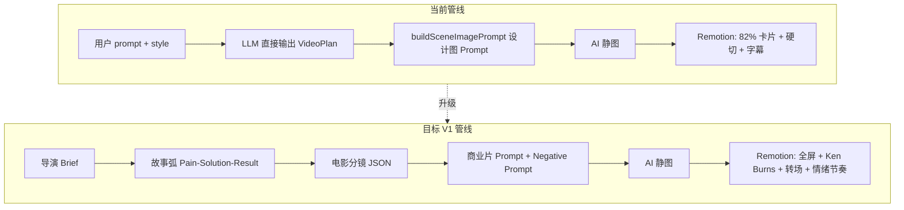
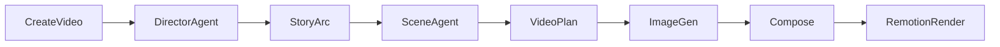

# XueAI AI 导演系统 V1.0 升级计划

## 现状诊断（代码层面）

当前管线本质是 ** narrated photo deck **，与用户期望的 SaaS 商业片差距主要在三层：



**关键证据：**

- 脚本 Prompt 在 [`backend/src/modules/ai/providers/openai-compatible.provider.ts`](backend/src/modules/ai/providers/openai-compatible.provider.ts) 只要求 `visual/description/voice`，无镜头/摄影/故事弧字段
- 生图 Prompt 在 [`shared/src/scene-image.ts`](shared/src/scene-image.ts) 追加 `single cinematic shot`，仍是**设计图思维**，无 camera motion / negative prompt
- Remotion 在 [`remotion/src/compositions/VideoComposition.tsx`](remotion/src/compositions/VideoComposition.tsx)：**静态 Img 82% 宽 + 居中卡片 + 硬切**，无转场、无镜头运动
- 前端 Plan Studio 的「特写推镜头」等 metadata 在 [`frontend/src/composables/useVideoPlanStudio.ts`](frontend/src/composables/useVideoPlanStudio.ts) 为**硬编码装饰**，未进入渲染

---

## V1 目标架构



新增 **两阶段 AI 生成**（替代当前一步到位）：

1. **Director Agent** — 输出 `DirectorBrief`（风格、受众、情绪、故事弧）
2. **Scene Agent** — 基于 Brief 输出带电影字段的 `CinematicScene[]`

---

## 阶段 1：数据模型（约 3 天）

### 1.1 扩展 Project — 导演 Brief

在 [`backend/prisma/schema.prisma`](backend/prisma/schema.prisma) 的 `Project` 上新增（或新建 `VideoDirector` 1:1 表，推荐 JSON 字段减少迁移复杂度）：

| 字段 | 类型 | 说明 |
|------|------|------|
| `audience` | String? | 目标用户，如「企业老板」 |
| `goal` | String? | 转化目标，如「提升注册转化」 |
| `videoStyle` | String? | 如 `apple_saas_commercial` |
| `emotion` | String? | 整体情绪基调 |
| `directorBrief` | Json? | 完整 Director Agent 输出 |

`directorBrief` JSON 结构（写入 [`docs/video-json-schema.md`](docs/video-json-schema.md)）：

```json
{
  "video_style": "Apple SaaS commercial",
  "emotion": "professional",
  "story_arc": [
    { "type": "pain", "duration": 5, "label": "运营凌晨还在整理 Excel" },
    { "type": "solution", "duration": 15, "label": "打开 SaaS 自动化流程" },
    { "type": "result", "duration": 10, "label": "团队轻松协作" }
  ],
  "negative_global": "plastic look, 3d render, cartoon, fake UI, floating card, template style"
}
```

### 1.2 扩展 Scene — 电影分镜字段

`Scene` 表新增列（全部 optional，兼容旧数据）：

| 字段 | 示例 |
|------|------|
| `storyBeat` | `pain` / `solution` / `result` / `cta` |
| `shotType` | `close_up` / `wide` / `tracking` |
| `cameraMotion` | `slow_dolly_in` / `pan_left` / `orbit` |
| `lighting` | `warm office ambient, soft shadows` |
| `emotion` | `stress` / `confidence` / `relief` |
| `action` | `person typing on laptop, checking dashboard` |
| `negativePrompt` | 镜头级 negative prompt |
| `transition` | `crossfade` / `push` / `cut` |
| `sceneType` | `live_action` / `ui_demo` / `abstract` |

### 1.3 共享类型升级

- [`backend/src/modules/project/project.types.ts`](backend/src/modules/project/project.types.ts) — 扩展 `videoPlanSceneSchema` + `updateSceneSchema`
- [`shared/src/render-input.ts`](shared/src/render-input.ts) — `RenderScene` 增加 `cameraMotion`, `shotType`, `transition`, `emotion`, `sceneType`
- [`frontend/src/types/index.ts`](frontend/src/types/index.ts) — 前端 Scene 类型同步

### 1.4 迁移

```bash
cd backend && npx prisma migrate dev --name add_director_cinematic_fields
```

---

## 阶段 2：AI 导演 Agent（约 5 天）

### 2.1 新建 Director 模块

| 文件 | 职责 |
|------|------|
| `backend/src/modules/director/director.service.ts` | 编排两阶段生成 |
| `backend/src/modules/director/director.types.ts` | `DirectorBrief`, `CinematicVideoPlan` Zod schema |
| `backend/src/modules/director/director.routes.ts` | `POST /api/ai/director`（可选预览 Brief） |
| `backend/src/modules/director/prompts/director.prompt.ts` | Director Agent 中文 Prompt 模板 |
| `backend/src/modules/director/prompts/scene.prompt.ts` | Scene Agent 电影分镜 Prompt 模板 |

### 2.2 改造脚本生成流程

修改 [`backend/src/modules/ai/script.service.ts`](backend/src/modules/ai/script.service.ts)：

```
generateScript(projectId)
  → directorService.generateBrief(project)     // Step 1
  → directorService.generateCinematicScenes()  // Step 2
  → normalizePlan + saveScript + replaceScenes
```

**Director Prompt 核心约束**（写入 `director.prompt.ts`）：

- 强制 `story_arc` 三段式：pain → solution → result（+ 可选 cta）
- 禁止抽象标题（如「黄金30秒视觉钩子」），要求**可拍摄的具体情境**
- 输出 `video_style` + `negative_global`

**Scene Prompt 核心约束**（写入 `scene.prompt.ts`）：

- 每个 scene 必须含 5 字段：`shotType`, `cameraMotion`, `lighting`, `emotion`, `action`
- `visual` 必须是**英文商业片 Prompt**（cinematic commercial, real people, natural motion）
- `voice` 遵循 Problem→Solution 叙事，禁止产品说明书口吻
- 禁止：UI 卡片截图描述、抽象「科技感」

### 2.3 改造 LLM Provider

在 [`openai-compatible.provider.ts`](backend/src/modules/ai/providers/openai-compatible.provider.ts) 拆出：

- `generateDirectorBrief(input)` — temperature 0.5
- `generateCinematicScenes(brief, projectMeta)` — temperature 0.7

保留旧 `generateVideoPlan` 作为 `legacy` fallback（无 API Key 时用 preset，preset 也升级为 pain-solution 模板）。

### 2.4 前端创建页增强

[`frontend/src/views/CreateVideo.vue`](frontend/src/views/CreateVideo.vue) 新增字段：

- 目标受众（audience）
- 视频目标（goal：转化/品牌/教程）
- 商业风格预设（Apple SaaS / 企业纪录片 / 快节奏促销）

[`frontend/src/api/script.ts`](frontend/src/api/script.ts) + project create API 传递新字段。

---

## 阶段 3：Prompt Engine 升级（约 3 天）

### 3.1 重写生图 Prompt 构建器

改造 [`shared/src/scene-image.ts`](shared/src/scene-image.ts) 的 `buildSceneImagePrompt`：

**新模板结构：**

```
Cinematic commercial still frame.
Scene: {action} in {environment from visual}.
Camera: {shotType}, {cameraMotion} feel.
Lighting: {lighting}.
Emotion: {emotion}.
Style: {videoStyle from directorBrief}, photorealistic, premium, 8K.
Motion hint: subtle natural movement, real people, documentary realism.
Avoid: {negativePrompt + negative_global}.
No text, no watermark, no UI card, no floating panel.
```

移除当前易产出 PPT 感的片段：
- ~~`Minimalist brand frame mark`~~
- ~~`single cinematic shot` 单独使用~~（改为完整 commercial 模板）

### 3.2 全局 Negative Prompt 常量

新建 [`shared/src/prompt-presets.ts`](shared/src/prompt-presets.ts)：

```typescript
export const COMMERCIAL_NEGATIVE_PROMPT = [
  'plastic look', '3d render', 'cartoon', 'fake UI',
  'floating card', 'template style', 'AI generated appearance',
  'powerpoint slide', 'white rectangle frame', 'stock photo watermark',
].join(', ')
```

Image provider 调用处（[`asset.service.ts`](backend/src/modules/asset/asset.service.ts)）若 API 支持 negative prompt 则传入；否则拼入正向 prompt 的 Avoid 段。

### 3.3 优化 Agent 同步升级

[`openai-compatible.provider.ts`](backend/src/modules/ai/providers/openai-compatible.provider.ts) 的 `optimizeVideoPlan` 增加校验：优化后必须保留/补全 5 个电影字段，否则 reject 并重试。

---

## 阶段 4：Remotion 商业片渲染升级（约 7 天）

### 4.1 新 Composition 结构

重构 [`remotion/src/compositions/VideoComposition.tsx`](remotion/src/compositions/VideoComposition.tsx)：

| 改动 | 说明 |
|------|------|
| 去掉 82% 卡片框 | 改为 **全屏 cover** 构图（`objectFit: cover`, 无白边/圆角卡片） |
| Ken Burns 组件 | 根据 `cameraMotion` 映射：`slow_dolly_in` → scale 1.0→1.08；`pan_left` → translateX |
| 转场 | 引入 `@remotion/transitions`，按 `scene.transition` 映射 crossfade/push |
| 字幕 | 底部 third 安全区 + 逐 scene fade in/out，非全程大字居中 |
| 背景 | 按 `emotion` 微调 gradient tint（stress=冷色，success=暖色） |
| BGM | 读取 `RenderInput.backgroundMusic`（schema 已有，渲染未实现） |

新建组件：

- `remotion/src/components/CinematicScene.tsx` — 单镜头（Img + motion + caption）
- `remotion/src/components/CameraMotion.tsx` — motion 映射表
- `remotion/src/utils/motion-map.ts` — `cameraMotion → interpolate config`

### 4.2 Render Input Builder 打通

修改 [`backend/src/modules/render/render-input.builder.ts`](backend/src/modules/render/render-input.builder.ts)：

- 从 Scene DB 读取 `cameraMotion`, `shotType`, `transition`, `emotion`, `sceneType` 写入 `RenderScene`
- 默认 transition：`crossfade`（除 first scene）

### 4.3 Plan Studio 预览对齐

[`frontend/src/components/studio/VideoPreviewStudio.vue`](frontend/src/components/studio/VideoPreviewStudio.vue) + [`useVideoPlanStudio.ts`](frontend/src/composables/useVideoPlanStudio.ts)：

- 移除硬编码 `'特写推镜头'`，改为读取 scene.`cameraMotion` / `shotType`
- 预览区应用 CSS Ken Burns 模拟（与 Remotion 参数一致）
- 分镜卡片展示 5 个电影字段（可编辑）

### 4.4 UI Demo 场景（V1 最小实现）

对 `sceneType === 'ui_demo'` 的镜头，V1 不做完整 React Dashboard Engine，改为：

- Prompt 层：要求「laptop screen showing SaaS dashboard, hands on keyboard, no isolated UI card」
- Remotion 层：可选叠加简单 `scale pulse` 暗示界面活跃

完整 `DashboardScene` 组件留 **V1.5**（[`remotion/src/compositions/DashboardScene.tsx`](remotion/src/compositions/DashboardScene.tsx) 占位）。

---

## 阶段 5：生产流水线调整（约 2 天）

修改 [`backend/src/modules/production/production.service.ts`](backend/src/modules/production/production.service.ts) 流水线标签与顺序不变，但在 SCRIPT 步骤前插入 **DIRECTOR** 任务（可选，或与 SCRIPT 合并为 `AI_DIRECTOR`）。

[`frontend/src/views/Production.vue`](frontend/src/views/Production.vue) 流水线 UI 更新为 7 步概念（导演 → 脚本 → 分镜 → 素材 → 配音 → 合成 → 渲染），V1 可将「导演+脚本」合并展示。

---

## 阶段 6（V2 预留，不在 V1 实施）

- 接入图生视频 API（Kling / Runway / fal-kling-o3 skill）替换部分 `live_action` 镜头的静图
- `Scene.videoUrl` 字段正式启用
- AI 质量评分 Agent（塑料感/节奏/商业感检测 → 自动重生成）
- SaaS UI 动态场景引擎（Remotion React 组件：`UserClick`, `ChartGrow`）

---

## 关键 Prompt 模板（V1 可直接使用）

### Director Agent 输出示例

```json
{
  "video_style": "Apple SaaS commercial, documentary realism",
  "emotion": "professional",
  "audience": "enterprise operations managers",
  "goal": "increase free trial signups",
  "story_arc": [
    { "type": "pain", "duration": 6, "beat": "Manager working late with spreadsheets" },
    { "type": "solution", "duration": 14, "beat": "Team adopts SaaS automation dashboard" },
    { "type": "result", "duration": 8, "beat": "Calm office, team collaborating" },
    { "type": "cta", "duration": 4, "beat": "Product logo moment, start free trial" }
  ]
}
```

### Cinematic Scene 输出示例

```json
{
  "index": 1,
  "storyBeat": "pain",
  "duration": 6,
  "title": "Late night operations",
  "description": "运营主管凌晨仍在处理订单表格",
  "shotType": "close_up",
  "cameraMotion": "slow_dolly_in",
  "lighting": "dim office, warm desk lamp, soft shadows",
  "emotion": "stress",
  "action": "person typing on laptop, rubbing temples, scattered papers",
  "visual": "Cinematic close-up of tired operations manager working late in modern office, laptop screen glow, realistic, premium commercial",
  "voice": "每天凌晨，还在手工对账？",
  "negativePrompt": "floating UI card, 3d render, cartoon",
  "transition": "crossfade",
  "sceneType": "live_action"
}
```

---

## 文件改动清单（按优先级）

| 优先级 | 文件 | 改动 |
|--------|------|------|
| P0 | `backend/prisma/schema.prisma` | Project/Scene 新字段 |
| P0 | `backend/src/modules/director/*` | 新建 Director 模块 |
| P0 | `openai-compatible.provider.ts` | 两阶段 LLM 调用 |
| P0 | `script.service.ts` | 接入 Director 流程 |
| P0 | `shared/src/scene-image.ts` | 商业片 Prompt 模板 |
| P0 | `VideoComposition.tsx` | 全屏 + Ken Burns + 转场 |
| P1 | `render-input.builder.ts` | 电影字段透传 |
| P1 | `CreateVideo.vue` | 受众/目标/风格输入 |
| P1 | `VideoPlan.vue` / Plan Studio | 电影分镜字段展示与编辑 |
| P1 | `docs/video-json-schema.md` | 新 schema 文档 |
| P2 | `production.service.ts` | 流水线步骤展示 |
| P2 | `shared/src/prompt-presets.ts` | Negative prompt 常量 |

---

## 验收标准（V1 完成定义）

针对「SaaS 产品宣传视频」类项目，生成结果应满足：

1. 分镜叙事为 **pain → solution → result**，而非功能列表 PPT
2. 每个 scene 含完整 5 电影字段且可在 Plan Studio 编辑
3. 生图 Prompt 含 camera/lighting/motion/avoid，无「卡片/截图」描述
4. 成片为 **全屏电影构图 + 镜头缓慢运动 + 场景转场**，非 82% 卡片硬切
5. 旧项目（无新字段）仍可正常渲染（默认值 fallback）

---

## 工期估算

| 阶段 | 内容 | 工期 |
|------|------|------|
| 1 | 数据模型 + 迁移 + 类型 | 3 天 |
| 2 | AI Director + Scene Agent | 5 天 |
| 3 | Prompt Engine | 3 天 |
| 4 | Remotion 商业片渲染 | 7 天 |
| 5 | 流水线 + 前端对齐 | 2 天 |
| **合计** | **完整 V1** | **~20 天** |
