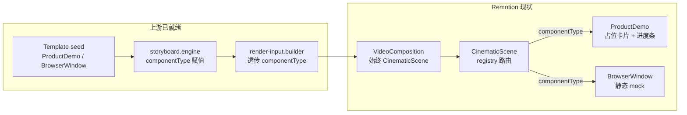
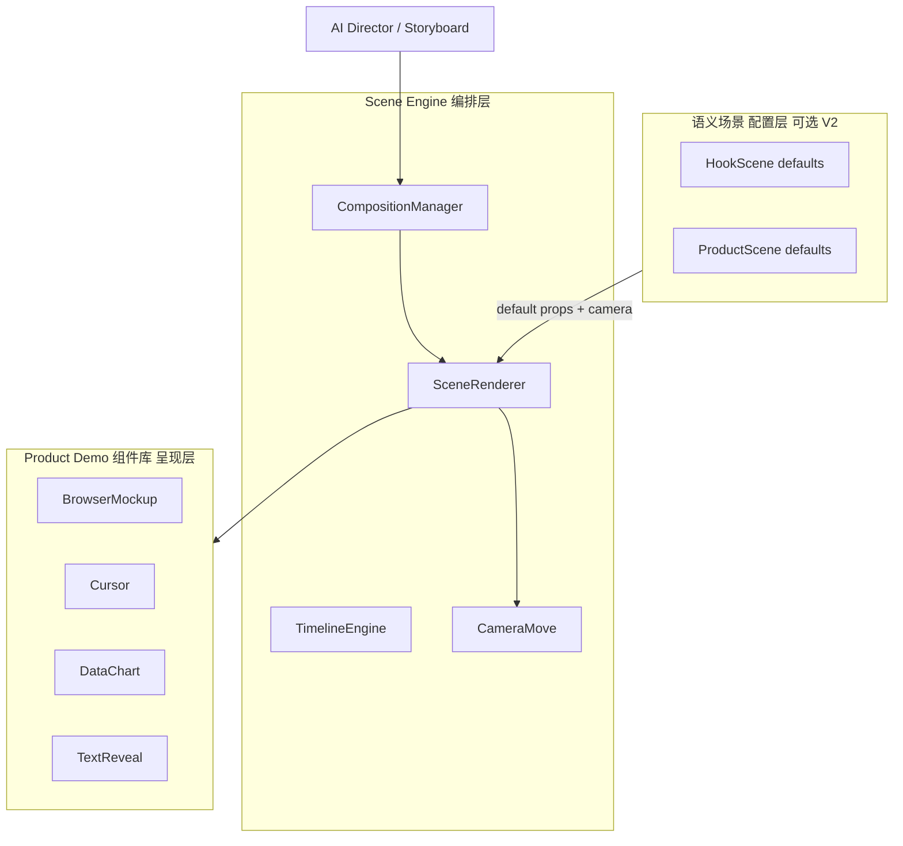

# Scene Engine vs Product Demo：优先顺序建议

## 结论：**先做 Scene Engine（薄 MVP），紧接着做 Product Demo v2**

不是二选一，而是 **引擎先行、组件跟进**。你 12 步计划里的 Step 3（Core）+ Step 4（Scene Engine）应合并成一个 3–5 天的薄 MVP；Product Demo 组件库作为 **第一个验收用例**，而不是在引擎之前堆 5 个独立组件。

---

## 现状快照（为什么现在不能先堆组件）



| 能力 | 状态 | 影响 |
|------|------|------|
| [`registry.ts`](remotion/src/video-engine/registry.ts) | 2 个组件注册 | 路由存在但组件是占位 |
| [`CinematicScene.tsx`](remotion/src/components/CinematicScene.tsx) L19–22 | `resolveSceneComponent` | 组件内各自写 enter 动画，无共享镜头层 |
| [`RenderScene`](shared/src/render-input.ts) | 无 `props` / `camera` / `animation` 结构化字段 | AI 无法驱动「鼠标点击 → 页面切换」 |
| [`template.seed.ts`](backend/src/modules/template/template.seed.ts) | 10 种 componentName | 8 种未实现，易诱导向量铺组件 |
| [`ProductDemo.tsx`](remotion/src/video-engine/components/ProductDemo.tsx) | 单卡片 spring | 不像真实 SaaS 操作演示 |

**核心矛盾**：模板和 Storyboard 已经在说「这镜是 ProductDemo + over_shoulder + slow_dolly_in」，但 Remotion 侧没有层去执行 **cameraRule + uiSteps + sfx 时间轴**。先写 Dashboard / Mobile / BeforeAfter 会把同一套 Sequence/镜头逻辑复制 5 遍。

---

## 两个选项对比

### 选项 A：先做 Product Demo 组件库

- **优点**：最快看到「不像 PPT」的视觉变化；与 [架构文档 Sprint 3](docs/video-intelligence-architecture.md) 一致
- **缺点**：
  - 每个组件自建 `spring + Sequence + 字幕`，后期 Scene Engine 接入时要整体 refactor
  - 无法实现你要求的「鼠标移动 / 点击 / 页面切换 / 数据变化」JSON 驱动（缺 `props.steps[]`）
  - 模板里的 `cameraRule`（如 `over_shoulder, slow_dolly_in`）对 UI 组件无效
  - AI Director → Remotion 链路（Step 11）没有稳定中间格式

### 选项 B：先做 Scene Engine（推荐）

- **优点**：
  - 定义一次 [`VideoScene`](shared) 契约：`component` + `camera` + `animation` + `audio` + `props`
  - `SceneRenderer` 统一包裹：镜头运动（复用 [`motion-map.ts`](remotion/src/utils/motion-map.ts)）+ 转场 + SFX 触发点
  - Product Demo 只关心 **UI 子组件**（BrowserMockup、Cursor、DataChart），不再管镜头
  - 与 Step 3 `VideoComposition JSON`、Step 11 AI 适配器自然衔接
- **缺点**：前 2–3 天产出偏「架构」，需 Product Demo v2 做可见验收

---

## 推荐实施顺序（2 个 Sprint）

### Sprint A — Scene Engine 薄 MVP（3–5 天）

**目标**：JSON 驱动单镜渲染，保持 [`RenderInput`](shared/src/render-input.ts) 向后兼容。

1. **共享契约** — 在 [`shared/src/`](shared/src/) 新增：
   - `video-scene.ts`：`VideoScene`, `CameraConfig`, `AnimationConfig`, `SceneAudioConfig`
   - `video-composition.ts`：`VideoCompositionJSON`（fps/width/height/scenes[]）
   - 扩展 `RenderScene`：可选 `props?: Record<string, unknown>`（或 `sceneProps` JSON 列映射）

2. **Core 层** — [`remotion/src/video-engine/core/`](remotion/src/video-engine/)：
   - `CompositionManager.tsx`：`VideoCompositionJSON` → `TransitionSeries` 编排（从 [`VideoComposition.tsx`](remotion/src/compositions/VideoComposition.tsx) 抽离）
   - `SceneRenderer.tsx`：统一入口 = CameraWrapper + Registry + CaptionLayer + SceneSFX
   - `TimelineEngine.ts`：duration 帧换算、cue → frame 映射（可先读现有 `cues` JSON）

3. **动画基座** — [`remotion/src/video-engine/animations/`](remotion/src/video-engine/)：
   - `CameraMove.tsx`：push / pull / pan / orbit（映射现有 `cameraMotion` + 模板 `cameraRule`）
   - `spring-presets.ts`：从 [`design-system/tokens.ts`](remotion/src/video-engine/design-system/tokens.ts) 导出统一 spring

4. **适配器** — [`backend/src/modules/render/render-input.builder.ts`](backend/src/modules/render/render-input.builder.ts)：
   - `buildVideoComposition(project)` 或在 builder 内生成 `VideoScene[]`
   - 映射：`componentType` → `component`，`cameraMotion` → `camera`，`cues` → `props.steps`（V1 可 heuristic）

5. **兼容策略**：
   - 未知 `component` → fallback [`CinematicScene`](remotion/src/components/CinematicScene.tsx) Ken Burns / B-roll
   - 不破坏现有生产流水线与 preview

**验收**：SaaS 模板 demo 镜 JSON 含 `component: "ProductDemo"` + `camera.type: "push_in"` 时，Remotion 预览可见镜头推进（即使 UI 仍是占位）。

---

### Sprint B — Product Demo v2 垂直切片（5–7 天）

**目标**：第一个「真实商业感」组件，验证 Scene Engine 契约。

1. **拆分组件库**（presentation 层，不含镜头逻辑）：
   - `components/BrowserMockup.tsx` — URL 栏 + 页面容器
   - `components/Cursor.tsx` — 鼠标轨迹 + 点击 ripple
   - `components/TextReveal.tsx` — 打字机 / word reveal
   - `components/DataChart.tsx` — 数字 spring 计数

2. **重写 ProductDemo** — 消费 `props`：
```typescript
// 目标 props 形状（AI / Storyboard 可生成）
interface ProductDemoProps {
  title: string
  steps: Array<{
    at: number        // 秒，相对镜内
    action: 'move' | 'click' | 'navigate' | 'dataChange'
    target?: string
    value?: string | number
  }>
  screenshot?: string  // scene.image 复用
}
```

3. **BrowserWindow v2** — 同样走 `SceneRenderer`，复用 BrowserMockup

4. **Storyboard 扩展** — [`storyboard.engine.ts`](backend/src/modules/video-intelligence/storyboard.engine.ts)：
   - `purpose === 'demo'` 时生成默认 `steps[]`（从 IPR process/result 推导）

5. **Studio 预览** — [`VideoPreviewStudio.vue`](frontend/src/components/studio/VideoPreviewStudio.vue) 对 demo 镜显示 steps 编辑器（可选，V1 可只读）

**验收**：SaaS 模板第 4 镜（demo / ProductDemo）渲染为：**浏览器框 + 鼠标移动点击 + 页面切换 + 数据变化**，非静帧 Ken Burns。

---

## 架构分层（避免 scenes/ 与 components/ 混淆）



- **Scene Engine**：怎么播（时间、镜头、音频、转场）
- **Product Demo 组件库**：播什么（UI mock、图表、光标）
- **HookScene / ProblemScene**（[`video-engine/scenes/`](remotion/src/video-engine/)）：不是第三套 UI，而是 **purpose → component + 默认 props/camera 的预设**（可 Sprint C 再做）

---

## 不建议现在做的事

- 一次实现 Dashboard / Mobile / BeforeAfter / CTA / HookScene 全部 8 个 seed 组件
- 在 Scene Engine 之前重写 [`VideoComposition.tsx`](remotion/src/compositions/VideoComposition.tsx) 为多 Composition 注册（Step 9 模板系统阶段再做）
- 复制 Remotion 仓库代码；只借鉴 `Series` / `Sequence` / `spring` 模式

---

## 决策摘要

| 问题 | 建议 |
|------|------|
| 先做哪个？ | **Scene Engine 薄 MVP** |
| Product Demo 何时做？ | Engine 契约冻结后 **立即跟进**（同一 Epic，连续 2 Sprint） |
| 如何快速看到效果？ | Sprint A 末用现有占位 ProductDemo + CameraMove 验证；Sprint B 换真实 UI 交互 |
| 与 12 步计划对齐 | Step 3 Core + Step 4 Scene Engine → Step 5/6 组件库 + 动画库 |

确认此顺序后，下一步可输出 **Step 2 目录设计**（`video-engine/core|scenes|components|animations|audio` 完整文件树 + 类型定义草案），仍不修改代码，等你确认再动手。
