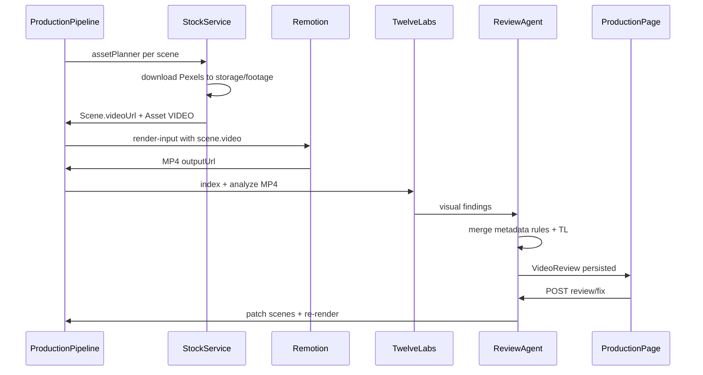
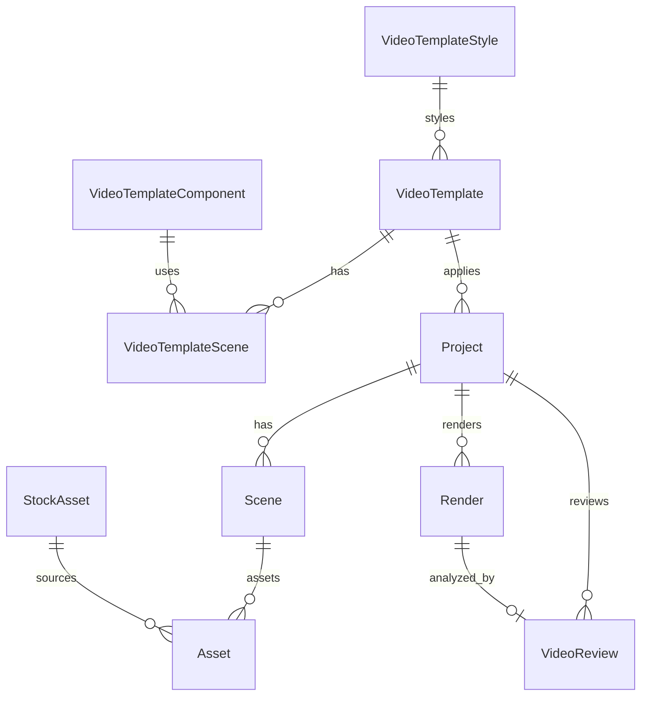

# Step 2：Prisma 完整表设计 + 30 天开发清单（含 V1.2 审片 / Pexels / TwelveLabs）

## 当前基线（Step 1 结论摘要）

- 流水线已通：`script → IMAGE → VOICE → COMPOSE → RENDER`（[production.service.ts](backend/src/modules/production/production.service.ts)）
- `Scene.videoUrl` 字段存在但 **未写入、未渲染**（[schema.prisma](backend/prisma/schema.prisma) L74）
- Review API 存在但 **仅 metadata LLM**，Production 页 **无 UI**（[review.service.ts](backend/src/modules/review/review.service.ts)、[Production.vue](frontend/src/views/Production.vue)）
- Pexels **仅 search**，无 download / attach（[stock.service.ts](backend/src/modules/stock/stock.service.ts)）
- `RenderScene` **无 video 字段**（[render-input.ts](shared/src/render-input.ts)）

---

## 一、目标数据流（V1.2 核心）



---

## 二、Prisma 完整表设计

> 开发期继续 **SQLite**；schema 写法兼容 **PostgreSQL**（Json、Float、无 SQLite 特有类型）。生产切换仅需改 `DATABASE_URL` + `provider = "postgresql"`。

### 2.1 模板引擎（Step 2 建表，Sprint 1 启用）

| 模型 | 用途 |
|------|------|
| `VideoTemplate` | 商业结构规则（非成品视频） |
| `VideoTemplateScene` | 每镜 purpose / component / camera_rule / durationRatio |
| `VideoTemplateStyle` | 色板、字体、motionFamily、negativePrompt |
| `VideoTemplateComponent` | 组件注册表（ProductDemo、BrowserWindow…） |

**VideoTemplate** 关键字段：`slug`, `name`, `category`, `duration`, `ratio`, `styleId`, `config Json`, `previewUrl`, `isSystem`

**VideoTemplateScene** 关键字段：`templateId`, `order`, `sceneType` (hook/problem/solution/demo/result/cta), `componentName`, `durationRatio`, `cameraRule`, `motionRule`, `promptRule`, `assetRole` (evidence/illustration)

**VideoTemplateComponent** 关键字段：`slug`, `name`, `remotionComponent`, `motionPattern`, `defaultDuration`, `configSchema Json`

### 2.2 项目 / 分镜扩展（与现有字段并存，渐进迁移）

**Project 新增：**

| 字段 | 类型 | 说明 |
|------|------|------|
| `templateId` | String? FK | 关联 VideoTemplate |
| `directorPlan` | Json? | 完整 DirectorPlan（逐步替代仅存 `directorBrief`） |
| `platform` | String? | douyin / bilibili / youtube |
| `storyboardStatus` | String? | draft / approved / locked |
| `reviewScore` | Float? | 最近一次 overallScore |
| `reviewVerdict` | String? | APPROVED / NEEDS_REVISION |
| `lastReviewId` | String? FK | 指向 VideoReview |

**Scene 新增：**

| 字段 | 类型 | 说明 |
|------|------|------|
| `purpose` | String? | hook / problem / solution / demo / cta |
| `componentType` | String? | cinematic_still / broll_video / ProductDemo… |
| `viewerTask` | String? | xueai: 观看任务 |
| `inputDesc` / `processDesc` / `resultDesc` | String? | IPR 三件套 |
| `motionDescription` | String? | 运动语言描述 |
| `soundEffect` | String? | SFX 提示 |
| `assetRequirement` | Json? | `{ role, type, source, prompt }` |
| `assetSource` | String? | pexels / ai / manual / stock |
| `stockMeta` | Json? | `{ pexelsId, photographer, license }` |
| `cues` | Json? | 口播 cue sheet |

保留现有：`shotType`, `cameraMotion`, `lighting`, `videoUrl`, `storyBeat` 等。

### 2.3 审片与 TwelveLabs（V1.2 重点）

**VideoReview**

```prisma
model VideoReview {
  id            String   @id @default(cuid())
  projectId     String
  renderId      String?
  source        String   // metadata_llm | twelvelabs | hybrid
  scores        Json     // plasticFeeling, commercialQuality, motionQuality...
  issues        Json     // [{ scene, problem, reason, solution, severity }]
  strengths     Json?
  overallScore  Float
  verdict       String   // APPROVED | NEEDS_REVISION
  priorityFix   String?
  twelvelabsIndexId   String?
  twelvelabsVideoId   String?
  rawAnalysis   Json?    // TwelveLabs 原始响应
  createdAt     DateTime @default(now())
  project       Project  @relation(...)
  render        Render?  @relation(...)
}
```

**Render 扩展：**

| 字段 | 说明 |
|------|------|
| `outputHash` | SHA256，审片绑定不可变文件 |
| `twelvelabsIndexId` | 索引 ID，避免重复 upload |

### 2.4 素材溯源（Pexels / Stock）

**StockAsset**（全局素材索引，可选 dedup）

| 字段 | 说明 |
|------|------|
| `provider` | pexels |
| `externalId` | Pexels video id |
| `localPath` | storage/footage/… |
| `url` | 本地或 CDN URL |
| `duration`, `width`, `height` | |
| `photographer`, `license` | 归因 |
| `metadata` | Json |

Scene 通过 `videoUrl` + `stockMeta` + `Asset(type=VIDEO)` 三重引用（与 xueai material-registry 思想一致）。

### 2.5 TaskType 扩展（流水线对齐）

在 [status.ts](backend/src/constants/status.ts) 新增：

- `STOCK` — Pexels 下载绑定
- `REVIEW` — 审片
- `OPTIMIZE` — 一键优化 + 重渲染

Production UI 7 步 + 第 8 步「AI 审片」可选显示。

### 2.6 ER 关系图



### 2.7 Seed 数据（Sprint 1）

5 套模板 slug：`saas-promo-60`, `ai-tool-intro-30`, `product-launch-45`, `brand-ad-30`, `tutorial-60` — 结构见 [video-intelligence-architecture.md](docs/video-intelligence-architecture.md) SaaS 6 镜示例。

### 2.8 迁移策略

1. **Migration 1**：Template 四表 + Seed
2. **Migration 2**：Project/Scene/Render 扩展字段
3. **Migration 3**：VideoReview + StockAsset
4. 现有 `directorBrief` **不删除**；新流程双写 `directorPlan`，读取优先 `directorPlan`

---

## 三、API 设计（Step 2 定义，Step 3+ 实现）

### 3.1 Review + TwelveLabs

| Method | Path | 行为 |
|--------|------|------|
| POST | `/api/projects/:id/review` | 渲染完成后触发；hybrid 审片 |
| GET | `/api/projects/:id/review/latest` | Production 页加载最近审片 |
| POST | `/api/projects/:id/review/fix` | 一键优化：patch scenes + 可选 re-render |
| POST | `/api/projects/:id/review/render` | 仅重跑 RENDER（优化后） |

**Review 策略（hybrid）：**

1. **规则层**（始终）：静态 >5s、连续 3 镜无 motion、缺 IPR（[xueai visual-quality-standard](skill/xueai-video-skills/check-video-visual-experience/references/visual-quality-standard.md)）
2. **Metadata LLM**（现有 [review.service.ts](backend/src/modules/review/review.service.ts)）
3. **TwelveLabs**（`TWELVELABS_API_KEY` 配置时）：upload/index MP4 → generate 分析 → 合并 issues

新建：`backend/src/modules/review/providers/twelvelabs.provider.ts`

Env：`TWELVELABS_API_KEY`, `TWELVELABS_INDEX_ID`（可选默认 index）

### 3.2 Pexels / Stock

| Method | Path | 行为 |
|--------|------|------|
| GET | `/api/stock/search` | 已有 |
| POST | `/api/stock/suggest` | 已有 |
| POST | `/api/stock/download` | 下载到 `storage/footage/{projectId}/` |
| POST | `/api/projects/:id/scenes/:sceneId/attach-stock` | 写 `videoUrl` + Asset + stockMeta |
| POST | `/api/projects/:id/stock/auto-fill` | Asset Planner：按 storyBeat 自动选 B-roll |

### 3.3 共享类型扩展

[shared/src/render-input.ts](shared/src/render-input.ts)：

```typescript
export interface RenderScene {
  // ...existing
  video?: string        // B-roll URL
  mediaType?: 'image' | 'video' | 'both'  // video 优先
}
```

[shared/src/review-types.ts](shared/src/review-types.ts) 扩展为 5 维目标分：

- `plasticFeeling`, `commercialQuality`, `motionQuality`, `storyClarity`, `audioQuality`（0–100 + 0–10 双标度内部统一为 0–100）

---

## 四、Remotion B-roll 改造要点

**文件：** [CinematicScene.tsx](remotion/src/components/CinematicScene.tsx)、[render-input.builder.ts](backend/src/modules/render/render-input.builder.ts)

逻辑：

```
if scene.videoUrl → <Video src={...} /> + 轻量 Ken Burns 裁切
else if scene.imageUrl → 现有 Img + Ken Burns
```

- 使用 `@remotion/media` 的 `<Video>`，`startFrom`/`endAt` 裁切至 scene.duration
- [render-asset-staging.ts](backend/src/modules/render/render-asset-staging.ts) 需 staging 本地 footage 文件
- Pexels 外链需 **先 download 到 storage**，避免渲染时网络失败

---

## 五、Production 页 UI 设计

**新建：** [frontend/src/components/intelligence/ReviewReport.vue](frontend/src/components/intelligence/ReviewReport.vue)

**嵌入：** [Production.vue](frontend/src/views/Production.vue) aside，位于「成片预览」下方

| 区块 | 内容 |
|------|------|
| 总分 | 0–100 环形 + verdict 徽章 |
| 五维雷达 | plastic / commercial / motion / story / audio |
| Issues 列表 | scene 编号、problem、solution、severity 色标 |
| 操作 | **一键优化**（调用 review/fix）、**重新审片**、**仍要下载**（NEEDS_REVISION 时二次确认） |

**交互：**

- `status.isComplete && isMp4` → 自动 `POST /review`（一次）
- 一键优化 → 展示 diff 摘要 → 触发 `POST /review/render` → WebSocket 更新进度

**API 客户端扩展：** [frontend/src/api/review.ts](frontend/src/api/review.ts) 增加 `fetchLatestReview`, `applyReviewFix`, `rerenderAfterFix`

---

## 六、一键优化（review/fix）逻辑

`backend/src/modules/review/review-fix.service.ts`：

1. 读取 `VideoReview.issues`
2. 按 `scene` 映射 patch：`cameraMotion`, `transition`, `componentType`, `motionDescription`
3. 若 issue 为「缺 B-roll」→ 调用 `stock/auto-fill` 绑定 `videoUrl`
4. 持久化 Scene + 创建 `VideoTask OPTIMIZE`
5. 可选：仅重跑 `RENDER`（素材/配音不变）或 `STOCK + RENDER`

**不自动改口播**（避免 TTS 全量重跑）；口播类 issue 标记为「需回 Studio 手动改」。

---

## 七、30 天 Cursor 开发任务清单

### Week 1（Day 1–7）：数据库 + Template Engine

| Day | 任务 ID | 交付物 |
|-----|---------|--------|
| 1 | DB-1 | Prisma Migration 1：Template 四表 |
| 2 | DB-2 | Migration 2：Project/Scene/Render 扩展 |
| 2 | DB-3 | Migration 3：VideoReview + StockAsset |
| 3 | TM-1 | `template.service` + seed 5 模板 |
| 4 | TM-2 | `GET /api/templates` + applyTemplate |
| 5 | TM-3 | CreateVideo TemplatePicker |
| 6 | TM-4 | 废弃 `templates.data.ts` 只读 fallback |
| 7 | — | 联调 + 文档更新 |

### Week 2（Day 8–14）：V1.2 审片 + Pexels + TwelveLabs

| Day | 任务 ID | 交付物 |
|-----|---------|--------|
| 8 | ST-1 | `stock.download` + storage 路径规范 |
| 9 | ST-2 | `attach-stock` + `auto-fill` + Asset Planner 规则 |
| 10 | RM-1 | `RenderScene.video` + builder 透传 |
| 11 | RM-2 | CinematicScene `<Video>` B-roll 分支 + staging |
| 12 | RV-1 | TwelveLabs provider + VideoReview 持久化 |
| 13 | RV-2 | hybrid review.service + review/fix |
| 14 | UI-1 | ReviewReport.vue + Production 集成 + 一键优化 |

### Week 3（Day 15–21）：Storyboard + Director 升级

| Day | 任务 ID | 交付物 |
|-----|---------|--------|
| 15–16 | SB-1 | `video-intelligence/storyboard.engine` |
| 17 | SB-2 | Scene IPR 校验 + StoryboardInspector |
| 18–19 | DR-1 | DirectorPlan 输出格式升级 |
| 20 | DR-2 | `/video/director` 独立页 |
| 21 | — | script.service 接入 storyboard |

### Week 4（Day 22–28）：Motion Engine 首组件

| Day | 任务 ID | 交付物 |
|-----|---------|--------|
| 22 | MO-1 | `video-engine/design-system` tokens |
| 23–24 | MO-2 | ProductDemo + BrowserWindow（spring） |
| 25 | MO-3 | Component registry + VideoComposition 路由 |
| 26 | MO-4 | DashboardAnimation 或 FeatureReveal 其一 |
| 27 | QC-1 | 接入 check-video-audio/visual scripts |
| 28 | — | E2E：模板 → 生产 → 审片 → 优化 → 再渲染 |

### Day 29–30：缓冲 + Postgres 迁移验证

- 生产 `DATABASE_URL` 切 Postgres  smoke test
- README / 环境变量文档

---

## 八、环境变量清单

```env
PEXELS_API_KEY=           # Stock 搜索与下载
TWELVELABS_API_KEY=       # 成片视觉分析（可选）
TWELVELABS_INDEX_ID=      # 可选默认 index
BGM_DEFAULT_URL=          # 已有
```

---

## 九、Step 2 完成后的下一步（Step 3）

确认本计划后，**Step 3 仅实现代码**：

1. 提交 Prisma migrations + seed（Week 1 DB-1～DB-3）
2. 或若优先 V1.2 体验：并行 **ST-1 → RM-2 → RV-2 → UI-1**（可先用 SQLite 新表，Template 表稍后）

**推荐执行顺序：** 先 **DB-1/2/3（1 天）** → 立即 **Week 2 V1.2 链路**，Template UI 可与 Week 2 并行。

---

## 十、风险与约束

- **TwelveLabs 成本/延迟**：大文件 upload 慢；需 `outputHash` 去重，同一 MP4 不重复 index
- **Pexels 许可**：`stockMeta` 必须存 photographer + 链接；UI 展示归因
- **不破坏现有功能**：无 `videoUrl` 时行为与现网一致（纯 Ken Burns 静帧）
- **SQLite EPERM**：`prisma generate` 需停 backend（已知问题）
