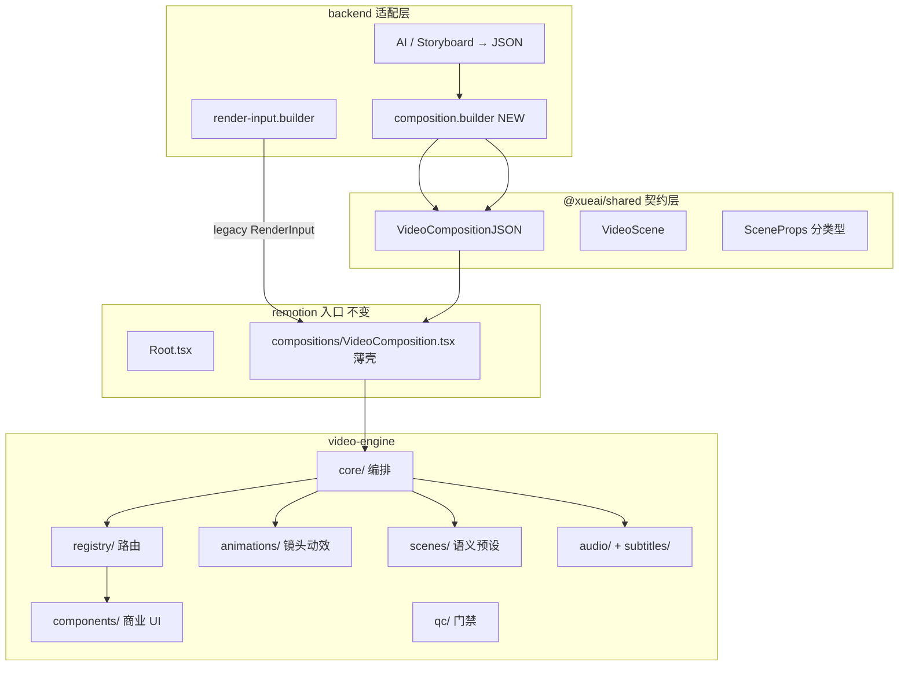
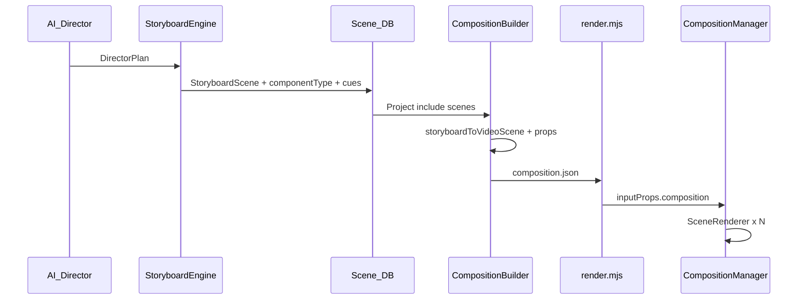

# video-engine/ 完整目录结构与模块接口设计（Step 2）

> **原则**：学习 Remotion 的 Composition / Series / Sequence 思想，封装为 XueAI 自有引擎；不复制 Remotion 仓库；每阶段可独立验收、不影响已有导出。

---

## 1. 总体分层



| 层 | 职责 | 不负责 |
|----|------|--------|
| **shared** | JSON 契约、props 类型 | React 组件 |
| **core** | 时间轴、转场、Scene 包裹 | 具体 UI 绘制 |
| **registry** | component → React 映射 | 业务逻辑 |
| **components** | ProductDemo 等呈现 | 镜头运动 |
| **scenes** | purpose 默认配置 | 重复 UI 实现 |
| **animations** | CameraMove 等可复用动效 | 场景编排 |
| **adapters** | RenderInput ↔ VideoCompositionJSON | DB 访问 |

---

## 2. 完整目录树

```
remotion/src/
├── index.ts                          # Remotion registerRoot（不变）
├── Root.tsx                          # Composition 注册（不变，props 类型扩展）
├── compositions/
│   └── VideoComposition.tsx          # 薄壳：委托 video-engine/core/CompositionManager
├── components/                       # 【遗留，逐步迁入 engine】
│   ├── CinematicScene.tsx            → 迁入 scenes/CinematicFallbackScene.tsx
│   └── AudioLayer.tsx                → 迁入 video-engine/audio/MusicTrack + ducking
├── utils/
│   └── motion-map.ts                 → 迁入 video-engine/animations/camera-presets.ts
│
└── video-engine/
    ├── index.ts                      # 引擎公开 API（供 compositions / QC / 测试引用）
    │
    ├── core/
    │   ├── CompositionManager.tsx    # VideoCompositionJSON → 全片 React 树
    │   ├── SceneRenderer.tsx         # 单镜：Camera + Component + Caption + SceneSFX
    │   ├── TimelineEngine.ts         # 秒↔帧、cue→frame、scene 窗口计算
    │   ├── TransitionEngine.ts       # transition 名 → TransitionSeries preset
    │   └── RenderContext.tsx         # React Context：fps、sceneIndex、compositionMeta
    │
    ├── registry/
    │   ├── scene-registry.ts         # component 名 → SceneComponent（替代根 registry.ts）
    │   ├── purpose-registry.ts       # purpose → 默认 component/camera/props
    │   └── types.ts                  # SceneComponent、RegistryEntry
    │
    ├── scenes/                       # 语义场景 = 预设 + 薄 wrapper（非第三套 UI）
    │   ├── createPurposeScene.tsx    # 工厂：合并 purpose 默认 + VideoScene.props
    │   ├── HookScene.tsx
    │   ├── ProblemScene.tsx
    │   ├── ProductScene.tsx
    │   ├── FeatureScene.tsx
    │   ├── ResultScene.tsx
    │   ├── CTAScene.tsx
    │   └── CinematicFallbackScene.tsx  # Ken Burns + B-roll（现有 CinematicScene 逻辑）
    │
    ├── components/
    │   ├── commercial/               # 模板 seed 对应的「整镜 UI 组件」
    │   │   ├── ProductDemo.tsx
    │   │   ├── BrowserWindow.tsx
    │   │   ├── DashboardAnimation.tsx
    │   │   ├── FeatureReveal.tsx
    │   │   ├── BeforeAfter.tsx
    │   │   └── CTA.tsx
    │   ├── mockups/                  # 可组合 mock  primitives
    │   │   ├── BrowserMockup.tsx
    │   │   ├── PhoneMockup.tsx
    │   │   └── VideoFrame.tsx
    │   ├── motion/                   # UI 动效 primitives
    │   │   ├── Cursor.tsx
    │   │   ├── TextReveal.tsx
    │   │   ├── DataChart.tsx
    │   │   └── ImageSequence.tsx
    │   └── shared/
    │       ├── SpringCard.tsx
    │       ├── SafeCaption.tsx
    │       └── MediaLayer.tsx        # image / video 统一裁切
    │
    ├── animations/
    │   ├── CameraMove.tsx            # 包裹 children，应用 transform
    │   ├── SpringAnimation.tsx       # 通用 spring enter/exit
    │   ├── Parallax.tsx
    │   ├── MaskReveal.tsx
    │   ├── BlurTransition.tsx
    │   ├── spring-presets.ts         # 从 design-system 导出
    │   └── camera-presets.ts         # 自 motion-map.ts 迁移
    │
    ├── audio/
    │   ├── CompositionAudio.tsx      # 全片 BGM + 全局 SFX（替代 AudioLayer）
    │   ├── SceneAudio.tsx            # 单镜 voice + scene 级 sfx
    │   ├── VoiceTrack.tsx
    │   ├── MusicTrack.tsx
    │   ├── SoundEffect.tsx
    │   └── ducking.ts                # buildVoiceWindows + BGM duck 曲线
    │
    ├── subtitles/
    │   ├── CaptionLayer.tsx          # 镜内 caption（样式来自 scene.caption）
    │   ├── SubtitleTrack.tsx         # cue 驱动逐词/逐句（V2）
    │   └── subtitle-timing.ts        # cue JSON → frame ranges
    │
    ├── adapters/
    │   ├── render-input.adapter.ts   # RenderInput → VideoCompositionJSON
    │   └── legacy-bridge.ts          # VideoCompositionJSON → RenderInput（preview 回退）
    │
    ├── design-system/
    │   ├── tokens.ts                 # 已有
    │   ├── typography.ts
    │   └── layout.ts                 # 安全区、16:9 / 9:16 比例常量
    │
    └── qc/
        ├── check-visual.ts           # 已有，扩展读 VideoCompositionJSON
        ├── check-audio.ts            # 静音段 / SFX 缺失
        └── check-scene-props.ts      # props schema 校验
```

**shared 新增**（契约与 AI 输出目标格式）：

```
shared/src/
├── video-composition.ts              # VideoCompositionJSON, CompositionMeta
├── video-scene.ts                    # VideoScene, CameraConfig, AnimationConfig, ...
├── scene-props/
│   ├── product-demo.ts               # ProductDemoProps
│   ├── browser-window.ts
│   ├── dashboard.ts
│   ├── feature-reveal.ts
│   ├── before-after.ts
│   ├── cta.ts
│   └── index.ts
└── adapters/
    └── storyboard-to-scene.ts        # StoryboardScene → VideoScene（backend 复用）
```

**backend 新增**：

```
backend/src/modules/render/
├── render-input.builder.ts           # 保留，内部可调用 compositionBuilder
└── composition.builder.ts            # Project/Scene DB → VideoCompositionJSON
```

---

## 3. 核心类型接口（shared）

### 3.1 VideoCompositionJSON

文件：[`shared/src/video-composition.ts`](shared/src/video-composition.ts)（新建）

```typescript
export interface CompositionMeta {
  id: string                    // e.g. "saas-promo-60"
  title?: string
  templateSlug?: string
  version: 1                    // schema 版本，便于迁移
}

export interface VideoCompositionJSON {
  meta?: CompositionMeta
  fps: number
  width: number
  height: number
  ratio: string
  duration: number              // 秒，≥ sum(scenes)
  scenes: VideoScene[]
  audio?: CompositionAudioConfig
}

export interface CompositionAudioConfig {
  backgroundMusic?: { url: string; volume: number }
  soundEffects?: Array<{
    url: string
    startFrame: number
    durationInFrames: number
    volume: number
    label?: string
  }>
}
```

### 3.2 VideoScene（Scene Engine 核心契约）

文件：[`shared/src/video-scene.ts`](shared/src/video-scene.ts)（新建）

```typescript
export type SceneComponentName =
  | 'CinematicFallback'
  | 'ProductDemo'
  | 'BrowserWindow'
  | 'DashboardAnimation'
  | 'FeatureReveal'
  | 'BeforeAfter'
  | 'CTA'
  | 'HookScene'
  | 'ProblemScene'
  // 扩展时在此 union 追加

export interface CameraConfig {
  shotType?: string             // close_up | wide | medium | over_shoulder
  type?: string                 // push_in | pull_out | pan_left | orbit | static
  speed?: number                // 0–1，默认 0.5
  lighting?: string
}

export interface AnimationConfig {
  enter?: 'spring' | 'fade' | 'none'
  primary?: string              // ui-interaction | ken-burns | stagger-reveal
  springPreset?: 'smooth' | 'snappy' | 'cinematic'
}

export interface SceneCaptionConfig {
  text: string
  style?: { font?: string; color?: string; fontSize?: number }
  highlightWords?: string[]     // V2 关键词高亮
}

export interface SceneAudioConfig {
  voiceUrl?: string
  voiceVolume?: number
  sfx?: Array<{
    url: string
    atSec: number               // 相对镜内起点
    volume?: number
    label?: string
  }>
}

export interface VideoScene {
  id: string                    // cuid 或 "scene-{order}"
  order: number
  purpose?: string              // hook | problem | demo | cta ...
  component: SceneComponentName
  duration: number              // 秒
  transition?: 'cut' | 'fade' | 'crossfade' | 'push'

  camera?: CameraConfig
  animation?: AnimationConfig
  caption?: SceneCaptionConfig
  audio?: SceneAudioConfig

  /** 强类型 props：按 component 在 scene-props/ 分文件定义 */
  props?: Record<string, unknown>

  /** 媒体 fallback（CinematicFallback / 混合镜） */
  media?: {
    image?: string
    video?: string
    mediaType?: 'image' | 'video' | 'both'
  }

  /** 导演元数据（QC / Review 用，不参与渲染） */
  meta?: {
    emotion?: string
    storyBeat?: string
    viewerTask?: string
    negativePrompt?: string
  }
}
```

### 3.3 ProductDemoProps 示例

文件：[`shared/src/scene-props/product-demo.ts`](shared/src/scene-props/product-demo.ts)

```typescript
export type UiStepAction = 'move' | 'click' | 'navigate' | 'dataChange' | 'type'

export interface UiStep {
  at: number                    // 秒，镜内相对时间
  action: UiStepAction
  target?: string               // CSS selector 语义 id，如 "#dashboard-chart"
  value?: string | number
  duration?: number             // 动作持续秒数
}

export interface ProductDemoProps {
  title: string
  subtitle?: string
  url?: string
  steps: UiStep[]
  screenshot?: string           // 可复用 media.image
  theme?: 'dark' | 'light'
}
```

### 3.4 RenderInput 兼容扩展

文件：[`shared/src/render-input.ts`](shared/src/render-input.ts)（扩展，不破坏现有字段）

```typescript
export interface RenderScene {
  // ... 现有字段 ...
  props?: Record<string, unknown>   // 新增：透传至 VideoScene.props
  purpose?: string                  // 新增：与 DB Scene.purpose 对齐
}

/** 可选：RenderInput 携带完整 engine JSON */
export interface RenderInput {
  // ... 现有字段 ...
  composition?: VideoCompositionJSON  // 若存在，CompositionManager 优先使用
}
```

---

## 4. Remotion 模块接口

### 4.1 CompositionManager

文件：[`remotion/src/video-engine/core/CompositionManager.tsx`](remotion/src/video-engine/core/CompositionManager.tsx)

```typescript
import type { VideoCompositionJSON } from '@xueai/shared'

export interface CompositionManagerProps {
  composition: VideoCompositionJSON
}

/** 全片入口：Audio + TransitionSeries + SceneRenderer[] */
export const CompositionManager: React.FC<CompositionManagerProps>

/** 供 Root.tsx calculateMetadata 使用 */
export function calculateCompositionMetadata(
  composition: VideoCompositionJSON,
): { durationInFrames: number; fps: number; width: number; height: number }
```

**职责**：
- 调用 `TimelineEngine.buildSceneTimeline(composition)`
- 渲染 `CompositionAudio` + `TransitionSeries`
- 每镜一个 `TransitionSeries.Sequence` → `SceneRenderer`

**[`VideoComposition.tsx`](remotion/src/compositions/VideoComposition.tsx) 变为**：

```typescript
// 伪代码
export const VideoComposition: React.FC<RenderInput> = (props) => {
  const composition = props.composition ?? adaptRenderInput(props)
  return <CompositionManager composition={composition} />
}
```

### 4.2 SceneRenderer

文件：[`remotion/src/video-engine/core/SceneRenderer.tsx`](remotion/src/video-engine/core/SceneRenderer.tsx)

```typescript
export interface SceneRendererProps {
  scene: VideoScene
  durationInFrames: number
}

/**
 * 渲染顺序（由外到内）：
 * 1. RenderContext.Provider
 * 2. CameraMove（若 camera.type 存在）
 * 3. resolveSceneComponent(scene.component)
 * 4. CaptionLayer（若 caption）
 * 5. SceneAudio（若 scene.audio）
 */
export const SceneRenderer: React.FC<SceneRendererProps>
```

### 4.3 TimelineEngine

文件：[`remotion/src/video-engine/core/TimelineEngine.ts`](remotion/src/video-engine/core/TimelineEngine.ts)

```typescript
export interface SceneTimelineEntry {
  scene: VideoScene
  fromFrame: number
  durationInFrames: number
  toFrame: number
}

export interface TimelineEngine {
  secToFrames(sec: number, fps: number): number
  buildSceneTimeline(composition: VideoCompositionJSON): SceneTimelineEntry[]
  mapCueToFrames(cues: Array<{ timeSec: number }>, sceneFromFrame: number, fps: number): number[]
  buildVoiceWindows(timeline: SceneTimelineEntry[]): Array<{ from: number; to: number }>
}

export const timelineEngine: TimelineEngine
```

### 4.4 Scene Registry

文件：[`remotion/src/video-engine/registry/scene-registry.ts`](remotion/src/video-engine/registry/scene-registry.ts)

```typescript
import type { VideoScene } from '@xueai/shared'

export interface SceneComponentProps {
  scene: VideoScene
  durationInFrames: number
}

export type SceneComponent = React.FC<SceneComponentProps>

export interface RegistryEntry {
  component: SceneComponent
  defaultCamera?: Partial<CameraConfig>
  defaultAnimation?: Partial<AnimationConfig>
  propsSchema?: string            // scene-props 类型名，供 QC 用
}

export function registerSceneComponent(name: string, entry: RegistryEntry): void
export function resolveSceneComponent(name: string): RegistryEntry | null
export function listRegisteredComponents(): string[]
```

**迁移**：现有 [`registry.ts`](remotion/src/video-engine/registry.ts) 合并入此文件；`CinematicFallback` 替代裸 `CinematicScene` 路由。

### 4.5 Purpose Registry

文件：[`remotion/src/video-engine/registry/purpose-registry.ts`](remotion/src/video-engine/registry/purpose-registry.ts)

```typescript
export interface PurposePreset {
  component: SceneComponentName
  camera?: Partial<CameraConfig>
  animation?: Partial<AnimationConfig>
  mergeProps?: (scene: VideoScene) => Record<string, unknown>
}

export function resolvePurposePreset(purpose: string): PurposePreset | null
export function applyPurposePreset(scene: VideoScene): VideoScene
```

与 [`storyboard.engine.ts`](backend/src/modules/video-intelligence/storyboard.engine.ts) 的 `defaultComponentType()` 对齐，Remotion 侧做最后一道默认合并。

### 4.6 CameraMove

文件：[`remotion/src/video-engine/animations/CameraMove.tsx`](remotion/src/video-engine/animations/CameraMove.tsx)

```typescript
export interface CameraMoveProps {
  camera?: CameraConfig
  durationInFrames: number
  children: React.ReactNode
}

/** 基于 camera-presets + interpolate/spring 施加 transform */
export const CameraMove: React.FC<CameraMoveProps>
```

### 4.7 Adapters

文件：[`remotion/src/video-engine/adapters/render-input.adapter.ts`](remotion/src/video-engine/adapters/render-input.adapter.ts)

```typescript
export function adaptRenderInput(input: RenderInput): VideoCompositionJSON
export function adaptRenderScene(scene: RenderScene, order: number): VideoScene
```

文件：[`backend/src/modules/render/composition.builder.ts`](backend/src/modules/render/composition.builder.ts)

```typescript
export class CompositionBuilder {
  async build(projectId: string): Promise<VideoCompositionJSON>
  /** 从单 Project + Scenes 构建，供 render CLI 写入 JSON */
}
```

---

## 5. 数据流（AI → 渲染）



**双轨兼容（过渡期）**：
- CLI 仍接受现有 `RenderInput` JSON（[`render.mjs`](remotion/scripts/render.mjs) 不改 argv）
- `adaptRenderInput()` 在 Remotion 内自动升级
- 后端可逐步改为写 `composition` 字段

---

## 6. 与现有文件映射

| 现有 | 目标 | 动作 |
|------|------|------|
| [`video-engine/registry.ts`](remotion/src/video-engine/registry.ts) | `registry/scene-registry.ts` | 迁移 + 扩展 |
| [`ProductDemo.tsx`](remotion/src/video-engine/components/ProductDemo.tsx) | `components/commercial/ProductDemo.tsx` | 重写 v2 |
| [`BrowserWindow.tsx`](remotion/src/video-engine/components/BrowserWindow.tsx) | `components/commercial/BrowserWindow.tsx` | 重写 v2 |
| [`CinematicScene.tsx`](remotion/src/components/CinematicScene.tsx) | `scenes/CinematicFallbackScene.tsx` | 迁入 engine，去掉 registry 耦合 |
| [`AudioLayer.tsx`](remotion/src/components/AudioLayer.tsx) | `audio/CompositionAudio.tsx` | 迁移 ducking |
| [`motion-map.ts`](remotion/src/utils/motion-map.ts) | `animations/camera-presets.ts` | 迁移，保留 re-export |
| [`VideoComposition.tsx`](remotion/src/compositions/VideoComposition.tsx) | 薄壳 | 委托 CompositionManager |
| [`render-input.builder.ts`](backend/src/modules/render/render-input.builder.ts) | + composition.builder | 并行输出 |

---

## 7. 分步实施计划（每步等待确认）

### Phase 0 — 契约冻结（1 天）【确认点 A】

- 新建 `shared/src/video-composition.ts`、`video-scene.ts`、`scene-props/*`
- 扩展 `RenderInput`（`props?`、`composition?`）
- **不改 Remotion 渲染行为**
- 验收：`pnpm --filter shared build` 通过；类型可被 backend/remotion 引用

### Phase 1 — Core 骨架（2 天）【确认点 B】

- 创建 `core/`：`TimelineEngine`、`TransitionEngine`、`RenderContext`
- 创建 `adapters/render-input.adapter.ts`
- `CompositionManager` + `SceneRenderer` 最小实现（仅 fallback Cinematic）
- `VideoComposition.tsx` 委托 CompositionManager
- 验收：现有项目渲染结果与升级前像素级一致（回归）

### Phase 2 — Registry + CameraMove（2 天）【确认点 C】

- 迁移 `scene-registry`；接入现有 ProductDemo / BrowserWindow 占位
- 实现 `CameraMove` + `camera-presets`（自 motion-map）
- `SceneRenderer` 包裹 CameraMove
- 验收：SaaS 模板 demo 镜可见 push_in 镜头；未知 component fallback

### Phase 3 — Audio / Subtitles 迁移（1–2 天）【确认点 D】

- `CompositionAudio` 替代 `AudioLayer`
- `CaptionLayer` 自 CinematicFallback 抽出
- `SceneAudio` 支持镜内 sfx（atSec）
- 验收：BGM duck、转场 whoosh 仍正常

### Phase 4 — Product Demo 组件库 v2（5 天）【确认点 E】

- `mockups/` + `motion/` primitives
- 重写 `ProductDemo`、`BrowserWindow` 消费 `ProductDemoProps`
- `composition.builder` + storyboard 生成默认 `steps[]`
- 验收：demo 镜 = 浏览器 + 鼠标 + 点击 + 数据变化

### Phase 5 — Purpose Scenes + 剩余 Commercial（5 天）【确认点 F】

- `purpose-registry` + 薄 wrapper scenes
- DashboardAnimation、FeatureReveal、BeforeAfter、CTA
- QC 扩展 `check-scene-props`
- 验收：5 套模板 seed 中已注册 component 均有实现或明确 fallback

### Phase 6 — 模板 JSON + RenderJob（后续，本设计预留）

- `templates/saas-commercial/template.json` 指向 `CompositionMeta.id`
- RenderJob progress（backend 已有 Render 表可扩展）
- 不在 Phase 0–5 范围内，确认 F 后再开

---

## 8. 公开 API（video-engine/index.ts）

```typescript
// 渲染入口
export { CompositionManager, calculateCompositionMetadata } from './core/CompositionManager'
export { SceneRenderer } from './core/SceneRenderer'
export { timelineEngine } from './core/TimelineEngine'

// 适配
export { adaptRenderInput } from './adapters/render-input.adapter'

// 注册扩展（插件式加组件）
export { registerSceneComponent, resolveSceneComponent } from './registry/scene-registry'

// QC
export { checkRenderInputVisual } from './qc/check-visual'
export { checkCompositionVisual } from './qc/check-visual'  // 新增 overload
```

---

## 9. 关键设计决策（已替你拍板）

1. **JSON 驱动**：渲染真源是 `VideoCompositionJSON`；`RenderInput` 为兼容层。
2. **scenes/ vs components/**：`scenes/` 只做 purpose 预设；真实 UI 在 `components/commercial/`。
3. **单 Composition**：短期保持 [`Root.tsx`](remotion/src/Root.tsx) 仅注册 `VideoComposition`；多 template Composition 留 Phase 6。
4. **props 类型**：shared 分文件定义；运行时 QC 校验，不引入 zod 重依赖（除非已有）。
5. **DB 字段**：Phase 0 可不改 Prisma；`props` 先存 `Scene.cues` 或新增 `sceneProps Json?`（Phase 4 前 migration）。

---

## 10. 下一步

确认本目录设计与接口后，从 **Phase 0（契约冻结）** 开始写代码；你回复「确认 Phase 0」即开工。
